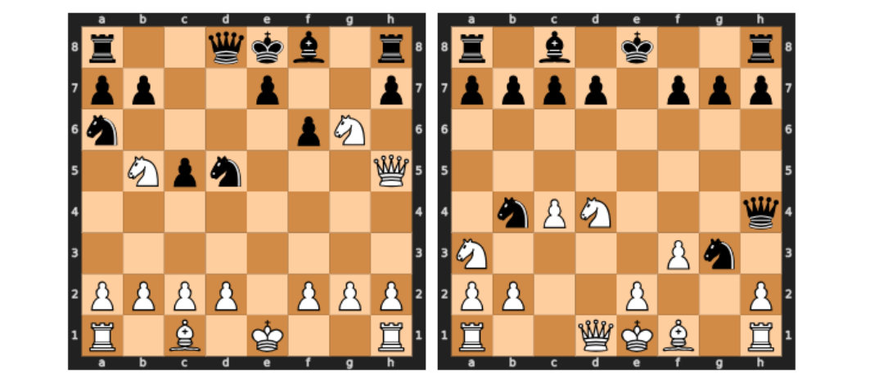
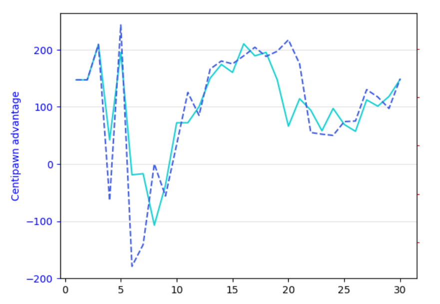

 # Re-evaluating Metamorphic Testing of Chess Engines: A Replication Study

Our work reproduced the original study "Metamorphic Testing of Chess Engines" published at [IST journal](https://www.sciencedirect.com/science/article/pii/S0950584923001179).
We also replicated it while varying three factors, namely: 1) the depth value; 2) the dataset through the inclusion of realistic positions; and 3) the version of Stockfish.
We found that the metamorphic relations are not as effective as in the original article, especially on realistic chess positions and increase of depth (original depth=10 was too low).
We raise awareness of the sensitivity of depth: metamorphic relations may only be violated at specific depths, and there is a depth threshold beyond which the testing method becomes ineffective for the studied metamorphic relations.
Through a rigorous and in-depth analysis of the source code, we found  why Stockfish can exhibit discrepancies on transformed positions and why at certain low depths, metamorphic relations are not effective.
Our overall conclusion is that it is not a bug, but a feature of the exploration process of modern chess engines.

 This repository contains:
 * all data (Stockfish analysis of all positions at different depth, with different version, and on transformations),
 * instructions to reproduce experiments,
 * scripts used to analyze data,
 * heatmaps and results integrated in notebooks.

## Background and intuition

Figure shows two chess boards evaluated by Stockfish of a game by
Magnus Carlsen grand master at depth = 20. The metamorphic relation "sim mirror" with a mirror symmetry
is applied on the right board. One would assume a similar evaluation by
Stockfish, but at depth = 20, the chess engine gives different results.
Yet, Stockfish returns an evaluation of +0.66 for the first board and of -2.17 for the second board.
It increases the advantage from slight to decisive advantage (of the previously white and now black).
Hence, it is tempting to conclude that the metamorphic relation is violated and that Stockfish is not robust to this transformation.

However, looking at the evolution of the evaluation w.r.t. the depth, we observe that the evaluation of the transformed position is subtle.
In this example, the evolution of the two lines is similar across depth, and the metamorphic relation is verified at depth 2, 3, 5, 9, 12,
13, 14, 15, 16, 17, 18, 19, 21, 23, 25, 26, 27, 28, 29, 30 for δ = 0.25 and ε = 25 as thresholds.
We also note that there could be stronger discrepancies, e.g., at depth=6 or at depth=20. There is some stability after depth 25 and the metamorphic relation then still holds.

This example shows two important aspects of the metamorphic testing of chess engines.
First, discrepancies can occur at certain specific depth (e.g., depth=20) and
then disappear or re-appear for subsequent depths. It shows the sensitivity
of the metamorphic testing to the depth factor. Metamorphic relation can
be violated depending on the choice of the depth or some discrepancies can
be ignored. Second, there exists a depth threshold, beyond which further increases in depth do not result in any violation of metamorphic relation.

**Our work revisits the original study and provides a more in-depth analysis of the Stockfish source code to explain why such discrepancies can occur and why the metamorphic relations are not as effective as in the original article especially on realistic chess positions and increase of depth (original depth=10 was too low).**

## Notebook and analysis scripts

See `data-notebook-results/reevaluating-SF-MT.ipynb` for the analysis and results.
There are several sections and subsections in the Notebook, and the overall organization is as follows:
 * utility fucntions for importing data and to transform positions
 * results with Stockfish 15 at depth=10, depth=15, and depth=20 on `mirror, sim_axis, sim_diag, better, first` transformations, using original dataset as well as our dataset (based on Lichess)
  - results of Section 4 can be traced back here (depth=10)
  - results of Section 5.1 and 5.2 can be traced back here
 * analysis on biggest gaps using larger depth (eg depth=30)
 * experiments on the Carlsen-Nepo game (Stockfish 15 and 16)
 * results with Stockfish 16 at depth=10 and depth=20 on `mirror, sim_axis, sim_diag, better, first` transformationsn,  using original dataset as well as our dataset (based on Lichess)
  - results of Section 5.3 can be traced back here

The notebook relies on Stockfish (you should edit the absolute path) as well as the data (see below for more information).
A PDF of all results is also available in the `data-notebook-results` folder.

## Stockfish source code analysis

We performed a rigorous and in-depth analysis of the Stockfish source code.
Hence resuls of Section 6 can be traced back here.
We found why Stockfish can exhibit discrepancies on transformed positions and why at certain low depths, metamorphic relations are not effective.
See folder `Stockfish_code_analysis` that contains specific instructions to reproduce the analysis.
SF commit used: d99f89506bd0ed535fb1c55dbb7cc8f7c29444d4

## Data

see `data-notebook-results` folder for all data

- **Mirror Transformation**
  - `sim_mirror_d=10`: Data at depth 10 with mirrored positions.
  - `sim_mirror_d=15`: Data at depth 15 with mirrored positions.
  - `sim_mirror_d=20`: Data at depth 20 with mirrored positions.

- **Sim Axis Transformation**
  - `sim_axis_d=10`: Data at depth 10 with sim axis transformations.
  - `sim_axis_d=15`: Data at depth 15 with sim axis transformations.
  - `sim_axis_d=20`: Data at depth 20 with sim axis transformations.

- **Sim Diagonal Transformation**
  - `sim_diag_d=10`: Data at depth 10 with diagonal symmetry transformations.
  - `sim_diag_d=15`: Data at depth 15 with diagonal symmetry transformations.
  - `sim_diag_d=20`: Data at depth 20 with diagonal symmetry transformations.

- **Better Transformation**
  - `better_d=10`: Data at depth 10 with "better" heuristic optimizations.
  - `better_d=15`: Data at depth 15 with "better" heuristic optimizations.
  - `better_d=20`: Data at depth 20 with "better" heuristic optimizations.

- **First Transformation**
  - `first_d=10`: Data at depth 10 applying the "first" heuristic approach.
  - `first_d=15`: Data at depth 15 applying the "first" heuristic approach.
  - `first_d=20`: Data at depth 20 applying the "first" heuristic approach.

## Authors

 - Axel Martin, Univ Rennes, CNRS, Inria, IRISA, France
 - Djamel Eddine Khelladi, Univ Rennes, CNRS, Inria, IRISA, France
 - Théo Matricon, University of Bordeaux, CNRS, LaBRI, Bordeaux, France
 - Mathieu Acher, Univ Rennes, CNRS, Inria, IRISA, France
